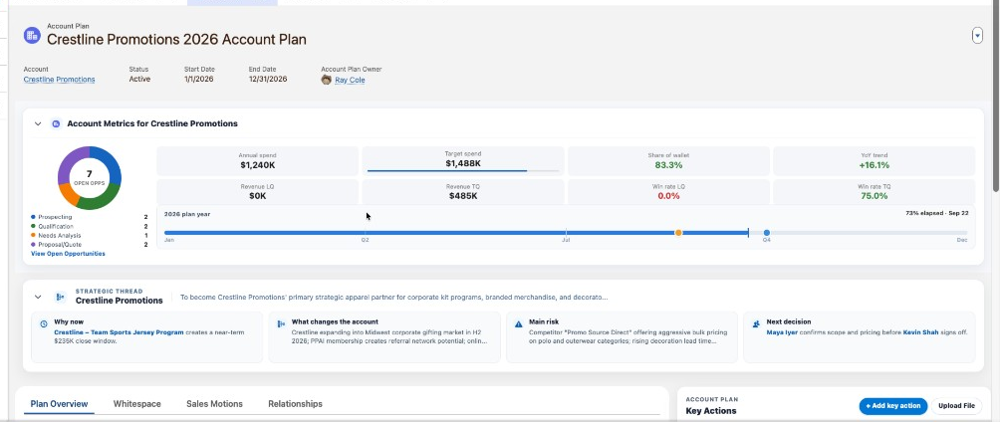
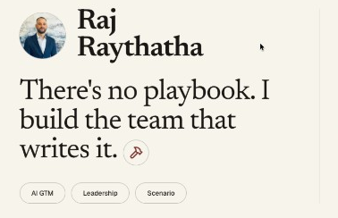
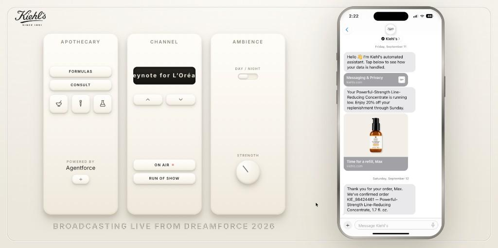

# Hi, I'm Raj

I'm a Solution Engineer at Salesforce, and I build almost everything in Cursor.
I tend to learn a product by building something real with it, so most of what I
make starts as a question I couldn't answer with a slide.

Here's what I've been working on lately.

## Account planning assistant

A tool that sits on top of an existing book of customer data and turns it into a
living account plan instead of a document someone updates once a quarter.

It reads what is already recorded about a customer, the open deals, the history,
the contacts, and drafts the parts of a plan people usually write by hand. That
includes a strategic summary, a strengths and weaknesses view, a read on the
competitive picture, a map of who reports to whom, a view of what the customer
already buys versus what they could, and a short list of suggested next actions.
Everything it drafts stays editable, and anything it generates can be traced back
to the underlying records rather than being invented.

The goal was to make account planning feel like reviewing a draft rather than
staring at a blank page.

**How I built it:** custom components and server side code on the Salesforce
platform, with the platform's own generative features doing the drafting. I built
it in Cursor in agent mode, with a set of custom Rules that kept every deployment
scoped to one component at a time, so an agent couldn't quietly flatten the work
I'd done by hand in the UI.

## Personal site with a built in assistant

A small single page site about my background and how I tend to approach a problem.

Rather than making someone read the whole thing, it has an assistant built in.
You can ask it a question in your own words and it answers from what's on the
page, so you can skip to whatever you actually care about.

**How I built it:** a React and TypeScript site with Tailwind for styling, and a
small backend route that passes questions to a language model with my own writing
as the context. I built it in Cursor by describing the section I wanted and then
going back and forth on the result until it read the way I'd say it out loud.

## Interactive conversation demo

A stage-ready demo built for a live audience presentation.

It simulates a customer service assistant in a messaging app, the kind that
handles where is my order, time to reorder, and here's your confirmation, and
plays the exchange out in real time on screen. The point was that a recorded
video can't be paused, redirected, or taken at a
different pace in front of a room, and a live system on conference wifi is a risk
nobody needs. This sits in between: it looks and behaves like the real thing and
it stays under the presenter's control.

It includes generated voice narration so the conversation can be followed without
reading the screen.

**How I built it:** a small Node and Express app serving a front end I wrote by
hand, plus a script that turns the script text into narration audio. The timing of
the conversation and the look of it were separate enough that I could keep Cursor
agents working on the two in parallel without them colliding.

## A note on the code

The code for these projects is private. The work was done in a professional
context, so the implementation details, the data, and the client specifics aren't
mine to publish, which is why the descriptions above stay general.

That said, I'm happy to walk through any of it. If you want to see how something
was built or why it was built that way, just reach out and I'll give you a tour.
